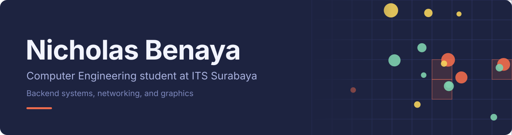
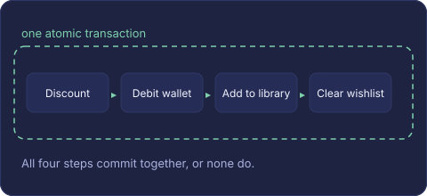
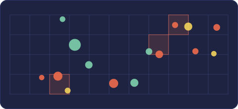
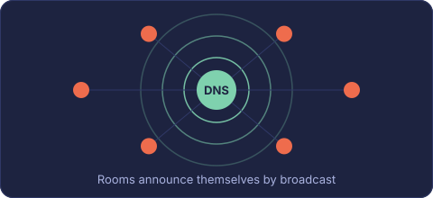
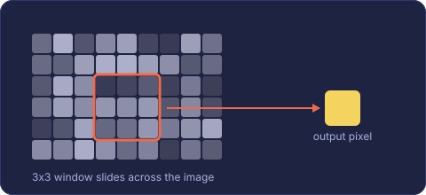

 

I'm a Computer Engineering student at ITS Surabaya, based between Surabaya and Samarinda. I like knowing how things work underneath: databases that stay correct under concurrent writes, protocols built straight on sockets, and image algorithms written out from the math instead of imported.

## Tools I use

<table>
  <tr>
    <td width="130"><b>Backend</b></td>
    <td></td>
  </tr>
  <tr>
    <td><b>Systems and vision</b></td>
    <td></td>
  </tr>
  <tr>
    <td><b>Client side</b></td>
    <td></td>
  </tr>
  <tr>
    <td><b>Workflow</b></td>
    <td></td>
  </tr>
</table>

## Projects

<table>
  <tr>
    <td width="45%"></td>
    <td valign="top">
      <h3><a href="https://github.com/nicholasbenaya/gamestore-be">GameVault API</a></h3>
      A REST backend for a digital game store, with separate user and publisher roles. Wallet top-ups and checkout run inside database transactions, so concurrent requests can't corrupt a balance. Uploaded images are converted to lossless WebP with Sharp and stored in S3-compatible storage, and every feature is covered by Jest and Supertest integration tests before merging.  
      Node.js, Express, Prisma, MySQL/TiDB, Sharp, S3/MinIO
    </td>
  </tr>
  <tr>
    <td width="45%"></td>
    <td valign="top">
      <h3><a href="https://github.com/nicholasbenaya/collision-simulation">Particle Collision Simulation</a></h3>
      Checking every pair of particles (O(N²)) stops scaling quickly. This engine only compares particles that share a grid cell, and the cell size adapts to particle mass, so frame rates hold up as density grows. The detector is modular, so it can be benchmarked against the brute-force version.  
      C++, SFML, spatial hashing
    </td>
  </tr>
  <tr>
    <td width="45%"></td>
    <td valign="top">
      <h3><a href="https://github.com/nicholasbenaya/simple-client-server">UDP Chat with a Custom DNS Service</a></h3>
      A LAN chat system that needs no configuration. Rooms register with a local name service over UDP broadcast, and clients find them the same way. It supports switching rooms while connected, public and private rooms, and clean socket shutdown, all without a networking framework.  
      Python, raw UDP and TCP sockets
    </td>
  </tr>
  <tr>
    <td width="45%"></td>
    <td valign="top">
      <h3><a href="https://github.com/nicholasbenaya/PCV_Tugas">Computer Vision Labs</a></h3>
      Course exercises where I wrote the algorithms myself: 2D convolution with Gaussian, Laplacian and Sobel kernels, histogram equalization from the CDF, and point transforms like gamma correction, log scaling and contrast stretching.  
      Python, NumPy, Matplotlib
    </td>
  </tr>
  <tr>
    <td width="45%"></td>
    <td valign="top">
      <h3><a href="https://github.com/nicholasbenaya/help-umkm">help-umkm</a></h3>
      Free websites for small Indonesian businesses. The first one is for Nadia Studio, a florist and makeup artist in Samarinda: a minimalist site with built-in analytics and WhatsApp lead tracking, and no database to pay for or maintain.  
      Next.js 14, React, Tailwind CSS
    </td>
  </tr>
</table>
